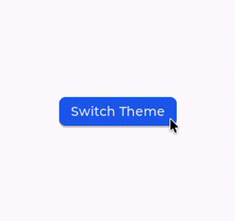

# simple_c

A simple theme switcher written in C. Clicking the button toggles between a light and a dark theme, demonstrating how to use multiple dynamic stylesheets and apply them at runtime.

<p align="center">
  
</p>

## What it demonstrates

- Generating multiple stylesheets from separate YAML files (`light.yaml`, `dark.yaml`)
- Using dynamic styles (`const: false`) initialized at runtime via `init_style_sheets()`
- Applying styles in C using the stylesheet-specific functions (`set_light_style`, `set_dark_style`)
- Switching styles at runtime on a button click event

## Build and run

```bash
cd examples
cmake --preset yaml_lv_style_examples
cmake --build --preset yaml_lv_style_examples
./cmake-build-release/examples/simple_c/simple_c_example
```